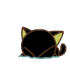

## Hey! Nice to meet you.

<!-- 右侧 gif -->


I'm Chanwing Chow.

<!-- 描述 -->
*Big Fan of [Kotlin](https://kotlinlang.org).*\
*Technical Lead at [Kiteio](https://kiteio.github.io).*

<!-- 联系方式 -->

[](https://space.bilibili.com/2029190948)

<!-- 计算机语言、框架 -->


\


<!-- Kotlin Hello World -->

```kotlin
fun main() {
    greeting("Hey, you look great today.")
}

fun greeting(message: String) = print(message)
```

### About Me

- 🌱 Currently learning Unreal Engine, C++ & ArkTS.
- 💻 Programming is ~~my whole life~~ part of my life.
- ☁️ Enjoys listening to music in my leisure time.
- 📚 Reading 《Dawn Blossms Plucked at Dusk》.
- 🧸 Favorite game is 《Don't Starve Together》.
- 🌈 Favorite anime is 《Scissor Seven》.
- ⛵ Wish to open my own snack bar in the future.

### Excerpt

> 不拼尽全力试一下，又怎么会知道啊。\
> How would you know if you don't give it your best shot.
>
> 任务之外，他人之事，绝不出手。\
> Outside of the mission, never get involved in the affairs of others.

<!-- 常用计算机语言统计 -->
